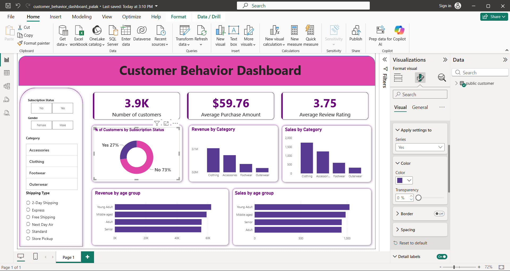

# Customer Behavior Analysis

A data analytics project analyzing customer purchasing behavior using Python, SQL, and Power BI to identify sales trends, revenue patterns, customer demographics, subscription behavior, and shipping preferences.

# 📌 Project Objective

The objective of this project is to analyze customer shopping behavior and generate actionable insights related to product categories, customer age groups, subscription status, sales, and revenue.

# 🛠️ Tools & Technologies

- **Python** – Data cleaning, preprocessing, and exploratory data analysis
- **SQL** – Data querying and analytical insights
- **Power BI** – Interactive dashboard and data visualization
- **CSV** – Source dataset

# 📊 Dashboard Preview

# 📈 Key Performance Indicators

- 3.9K – Total Customers
- $59.76 – Average Purchase Amount
- 3.75 – Average Review Rating
- 73% – Customers without a subscription

# 🔍 Analysis Performed

- Revenue by product category
- Sales by product category
- Revenue by customer age group
- Sales by customer age group
- Customer subscription status
- Shipping type analysis
- Category-wise customer analysis
- Customer purchasing behavior analysis

#💡 Key Insights

- **Clothing** generated the highest revenue among the analyzed product categories.
- **Clothing** also recorded the highest sales compared with other categories.
- **Young Adult** customers contributed the highest sales among the analyzed age groups.
- **73% of customers were non-subscribers**, while 27% had an active subscription.
- The overall **average purchase amount was $59.76**, with an average review rating of **3.75**.

# 🗂️ Project Files

| File | Description |
|------|-------------|
| `customer_behavior_dashboard_palak.pbix` | Power BI dashboard |
| `customer_behavior.ipynb` | Python data analysis and exploration |
| `SQL_Queries.sql` | SQL analytical queries |
| `customer_shopping_behavior (1).csv` | Source dataset |
| `dashboard.png` | Dashboard preview |

# 🎯 Business Recommendations

- Investigate opportunities to increase subscription adoption among non-subscribers.
- Focus marketing efforts on high-performing product categories such as Clothing.
- Develop targeted campaigns for high-performing customer age groups.
- Use customer purchasing patterns to improve product and promotional strategies.

# 👩‍💻 Project Skills Demonstrated

**Data Cleaning • Exploratory Data Analysis • SQL • Python • Power BI • Data Visualization • Business Insights**
